Rawalpindi, Pakistan · BS Artificial Intelligence, Air University, Islamabad (2023–2027, final year) · open to full-time roles

**[Email](mailto:sameer.raza@live.com)&nbsp;·&nbsp;[LinkedIn](https://linkedin.com/in/sameerrazamalik)&nbsp;·&nbsp;[GitHub](https://github.com/SameerRaza-2003)**

 

I build systems that turn raw signal — audio, images, documents, natural language — into a decision a product can act on. In the last year that's meant a production RAG chatbot answering real study-abroad questions, a full-stack platform that turns a WhatsApp message into a scheduled LinkedIn post, and a two-stage pipeline that has to find and track a drone in real time on a single Jetson Nano. I'm most interested in the unglamorous half of ML engineering: the caching layer that stops a redundant LLM call, the freshness classifier that catches a stale answer before a user sees it, the confidence threshold that decides when an embedding lookup is good enough and when it needs to escalate.

---

## Experience

**AI Engineer**, FES Consultants — *Sept 2025 – Jun 2026* `promoted from Intern`

- Built **Mentora**, a production RAG chatbot (FastAPI, GPT-4, Pinecone, Tavily, Redis, SSE streaming) with a two-stage freshness classifier and a 24-hour SQLite answer cache to cut redundant LLM calls and hallucinations
- Architected the **FES Workflow Management Portal** — a full-stack Next.js + FastAPI RBAC platform with MongoDB, JWT auth, GPT-4o-mini content generation, and WhatsApp/Twilio NLP commands that publish directly to Facebook, Instagram, and LinkedIn
- Delivered a multi-modal **OCR consolidation agent** (Gemini + EasyOCR) that parses multiple PDFs in parallel into one structured schema
- Built a semantic course-finder with a Pinecone freshness router — cached embeddings resolve high-confidence matches, with an LLM call only as fallback

**AI Engineer Intern**, FES Consultants — *Jul – Sept 2025*

- Built the original Mentora infrastructure — Pinecone indexing, ingestion/chunking pipeline, OpenAI embeddings — and shipped an OCR consolidation agent strong enough to convert the internship into a full-time offer

---

## Selected work

<table>
<tr>
<td width="50%" valign="top">

**Autonomous counter-drone system** `in progress`
*Final year project · 2026–2027*

A ground MEMS mic array feeds an FFT/Mel spectrogram into a MobileNetV2 classifier (>85% confidence) for TDOA bearing estimation, while a YOLOv8 → DeepSORT + Kalman pipeline tracks the target visually. A PID loop drives real-time yaw/pitch/throttle to a Pixhawk over MAVLink from a Jetson Nano.

`YOLOv8` `DeepSORT` `Kalman Filter` `TDOA` `Pixhawk` `Jetson Nano`

</td>
<td width="50%" valign="top">

**Janus — multi-agent orchestration**
*Team project · 2026*

A federated system of domain-specialized agents — Academic, Scheduling, Communications, Web Search — each running its own ReAct loop. I built the Janus Router, a FastAPI intent classifier that directs natural-language queries across Google Classroom, Calendar, and Drive.

`FastAPI` `React` `ReAct Loop` `Google Workspace APIs`

</td>
</tr>
<tr>
<td width="50%" valign="top">

**RetinaAI — medical CV platform**
*2026*

A 4-class diabetic retinopathy classifier trained on real clinical fundus images, benchmarked across six architectures. MixUp + soft focal loss on EfficientNet-V2-S reached **F1 0.917, 91.2% accuracy, ROC-AUC 0.973**. Grad-CAM explainability, FastAPI/OAuth2 inference backend, Next.js dashboard.

`EfficientNet-V2-S` `MixUp` `Grad-CAM` `FastAPI` `Next.js`

</td>
<td width="50%" valign="top">

**FatigueNet — multimodal fatigue classification**
*Research · 2026*

A full replication of the FatigueNet pipeline (ECG/EMG/EDA/eye-blink) with per-modality encoders, a Graph Attention Network + MetaNet fusion, and a temporal transformer — **81.25%** window-level accuracy. An HRV+EMG XGBoost fusion model reached **83.33% / 0.83 F1**. Written up as an IEEE-style paper.

`GAT` `MetaNet` `XGBoost` `LightGBM` `NeuroKit2`

</td>
</tr>
<tr>
<td width="50%" valign="top">

**Quranic Therapist**
*LLM fine-tuning & RAG · 2025*

A mental-wellness chatbot grounded in Islamic knowledge — Gemma 7B and Mini-LLaMA 1B fine-tuned on Quran ayat translations, deployed publicly on Hugging Face. Benchmarked against a FAISS + LangChain RAG pipeline, which won on both quality and latency.

`Gemma 7B` `LangChain` `FAISS` `Gemini API`

</td>
<td width="50%" valign="top">

**Resume ranking system**
*NLP & embeddings · 2024*

Benchmarked TF-IDF, Word2Vec, and BERT for resume-to-JD matching — BERT cosine similarity reached **~90% precision** on top candidates. Gemini generates a natural-language explanation for every ranking, so the screening decision is fully auditable.

`BERT` `Word2Vec` `TF-IDF` `Gemini API`

</td>
</tr>
</table>

---

## Stack

**Languages**

**Deep learning & computer vision**

 &nbsp; `YOLOv8` `Hugging Face Transformers`

**Agentic AI & LLM orchestration**

`LangChain` `LangGraph` `OpenAI API` `Gemini API` `Pinecone`

**Systems & infrastructure**

**Robotics & edge**

`Jetson Nano` `Pixhawk / MAVLink`

---

## Activity

<picture>
  <source media="(prefers-color-scheme: dark)" srcset="https://raw.githubusercontent.com/SameerRaza-2003/SameerRaza-2003/output/github-contribution-grid-snake-dark.svg">
  <source media="(prefers-color-scheme: light)" srcset="https://raw.githubusercontent.com/SameerRaza-2003/SameerRaza-2003/output/github-contribution-grid-snake.svg">
  
</picture>

<table>
<tr>
<td width="50%">

<picture>
  <source media="(prefers-color-scheme: dark)" srcset="https://github-stats-extended.vercel.app/api?username=SameerRaza-2003&show_icons=true&hide_border=true&bg_color=00000000&title_color=8b98a5&text_color=c9d1d9&icon_color=8b98a5">
  <source media="(prefers-color-scheme: light)" srcset="https://github-stats-extended.vercel.app/api?username=SameerRaza-2003&show_icons=true&hide_border=true&bg_color=00000000&title_color=57606a&text_color=24292f&icon_color=57606a">
  
</picture>

</td>
<td width="50%">

<picture>
  <source media="(prefers-color-scheme: dark)" srcset="https://github-stats-extended.vercel.app/api/top-langs/?username=SameerRaza-2003&layout=compact&hide_border=true&bg_color=00000000&title_color=8b98a5&text_color=c9d1d9">
  <source media="(prefers-color-scheme: light)" srcset="https://github-stats-extended.vercel.app/api/top-langs/?username=SameerRaza-2003&layout=compact&hide_border=true&bg_color=00000000&title_color=57606a&text_color=24292f">
  
</picture>

</td>
</tr>
</table>

---

Always glad to talk deep learning, agentic systems, or computer vision — reach out any time.

